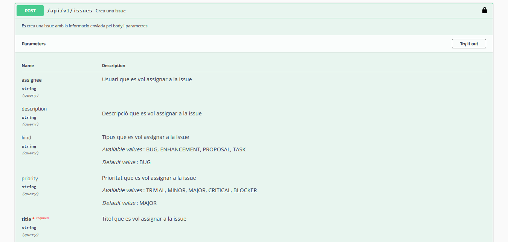

# REST API IssueTracker

A REST API based on level 2 from the Richardson Maturity Model. Made it in Spring Boot and a Swagger UI

## Screenshots

#### Authorization

#### Attachment

#### Issue

#### User

---

##### POST Issue details

##### POST Issue example

##### POST Issue response

## Authors
- Danci, Marian Dumitru
- Ait Fonollà, Adem
- Segura Sánchez, Enric
- Conesa Gago, Agustí

Link heroku:
https://grup13aswd-rest-api-blabla.herokuapp.com/api/swagger-ui.html